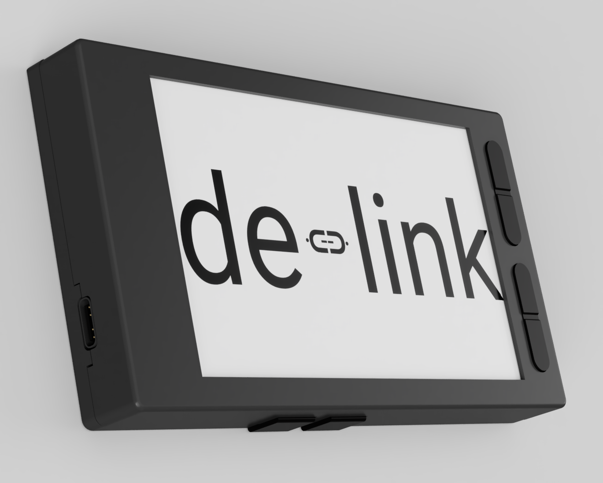
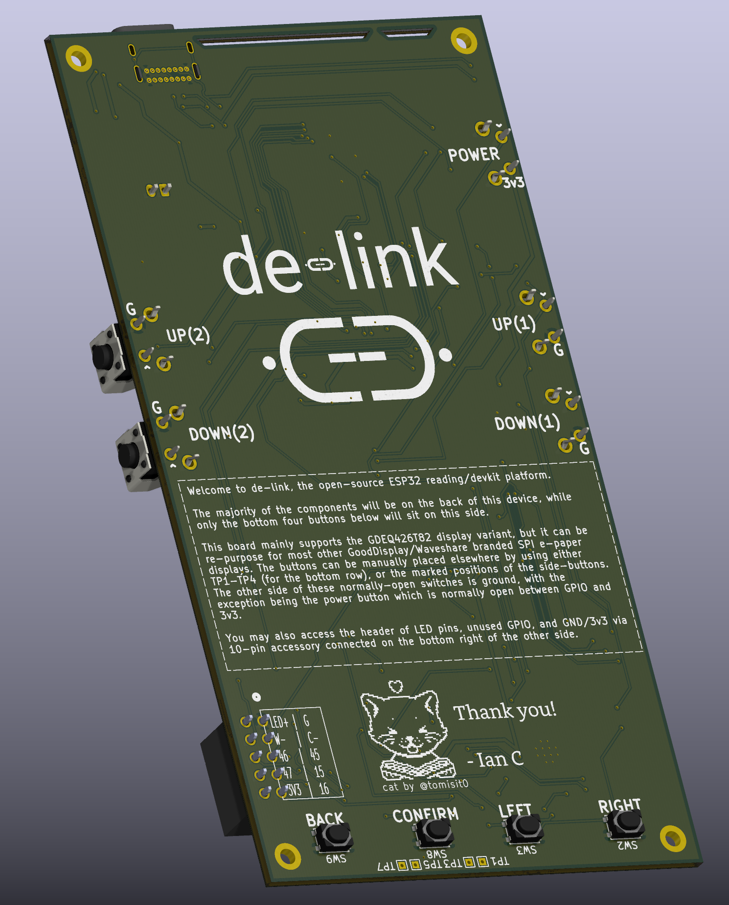
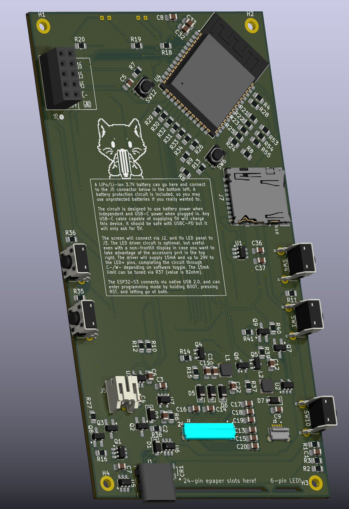
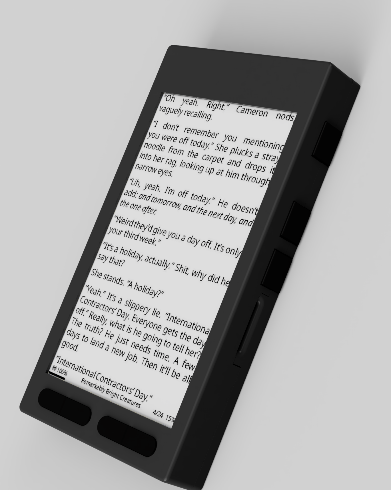
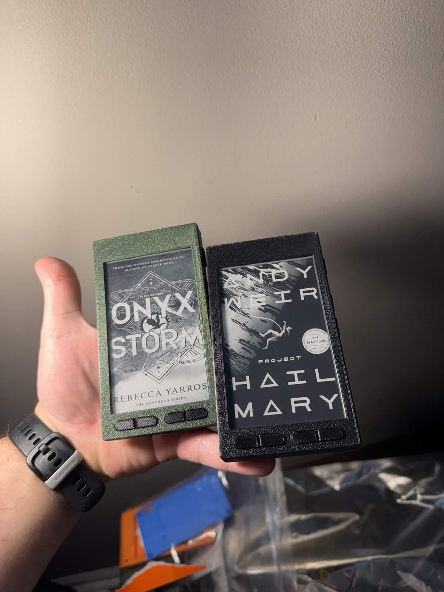
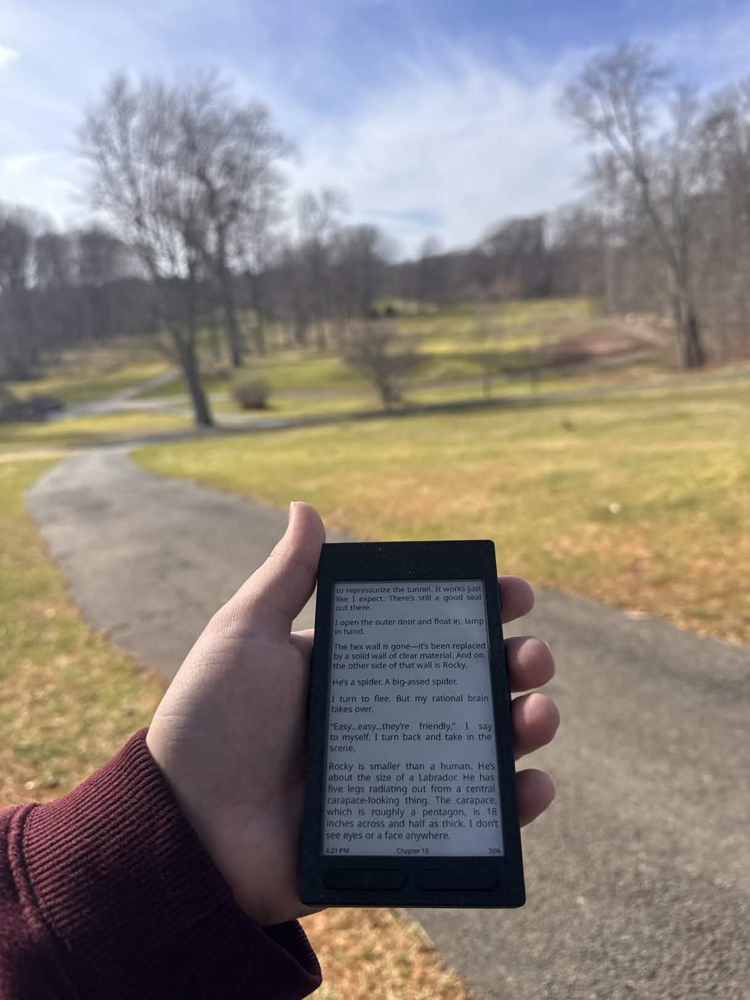
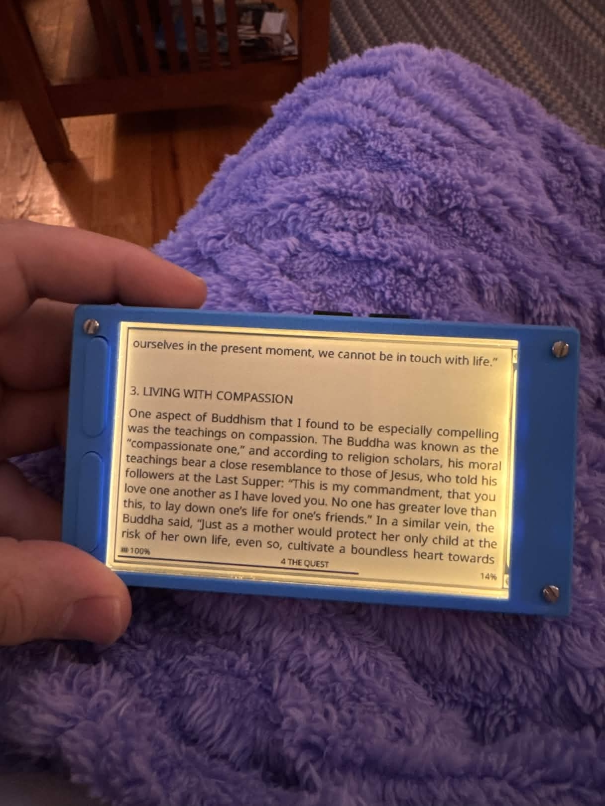

# de-link

  

An open-source ESP32-S3 e-paper development kit. Offers hardware access to 24-pin e-paper communication over SPI, 4-bit SDMMC, USB-C, button array, and optional modules for series LED driver and battery overcharge/discharge protection.

---

## The PCB

The heart of de-link. Designed to work with any GoodDisplay 24-pin SPI e-paper display.

  
  

**Specifications:**
- **MCU:** ESP32-S3 (240 MHz dual-core, 512 KB SRAM, PSRAM (buy whichever you want), 16MB Flash)
- **Display Interface:** 24-pin SPI e-paper (supports 3.97", 4.26", 7.5", and more)
- **Storage:** 4-bit SDMMC microSD interface
- **Power:**  LiPo battery with overcharge/discharge protection (bring your own battery)
- **Connectivity:** Wi-Fi 802.11b/g/n, Bluetooth LE, USB-C with OTG
- **Input:** Dual 4-switch resistor ladders, multi-function GPIO, reset button
- **Optional Modules:** Series LED driver for frontlight (cool/warm control), battery protection circuit for salvaged single-cell lithium batteries

---

## My Prototype

This is my first working prototype built around a 4.26" GoodDisplay panel in a 3D-printed enclosure. It's functional and something I use every day, but it's just the starting point. The design is open so you can build your own with any compatible display size. For more info on that, check [out things I've been trying.](markdown/PROTO.md)

  
  
<em>Initial prototype: 4.26" display with 3D-printed case</em>

The enclosure is fully customizable and 3D-printable. Most PCB components are hand-solderable (0805/SOT-23). When something fails, you replace it. The screen is removable. You can reprint the case as many times as you need.

---

## Hardware in Action

  

    
    
<em>My current prototypes (mine and my gf's)</em>

  

  

    
    
<em>Out and about</em>

  

  
  
<em>Optional frontlight module with cool/warm tuning. **THIS IS THE FIRST UNIT I BUILT, THE ONES ABOVE ARE NEWER.**</em>

---

## Why This Exists

My Kindle's frontlight broke. I wanted an e-reader I could actually control and repair. So I designed a PCB, built a case, and got it working. Now I'm sharing it because I believe open hardware leads to better hardware.

See [Philosophy](markdown/PHILOSOPHY.md) for the full story.

**This project needs community support to grow.** Without contributors, testers, and feedback, this remains a single prototype on my desk. The roadmap, timeline, and future direction all depend on community engagement. If you're interested in e-paper, open hardware, or just building cool things, join in.

---

## Hardware and Software

- **PCB Design** - See the KiCad files at my repo [here](https://github.com/iandchasse/de-link-pcb), I will provide 1.0 production files later. See Roadmap below.
- **Firmware** - Check out my fork of [crosspoint-reader](https://github.com/iandchasse/crosspoint-reader-de-link/tree/s3-port) for e-reader software built on de-link, as well as the "sdk" that has display code for the 4.26" display as well as the buttons/sd card [here](https://github.com/iandchasse/community-sdk-de-link/tree/s3-port)
- **3D Enclosures** - Coming soon, access first by supporting

---

## How much does it cost?

See [cost breakdown](markdown/COST.md) for the rough BOM and a full picture of how much a unit should cost. **TLDR: About $60ish before shipping, maybe a bit more if you pay for PCBA**. But I implore you to try and build it yourself. All components are hand-solderable for most with basic soldering materials, save for the pesky ribbon cables which interface to the display.

---
## What's the battery life?

It will depend on the software and the battery that's used. Both are up to you. However if using with [crosspoint-reader](https://github.com/iandchasse/crosspoint-reader-de-link/tree/s3-port) and reading for ~30 minutes a day with a 650mAh battery, it should last for weeks. I don't really know. See my current-draw measurements [here](markdown/PROTO.md).

---

## Learn More
- **[Cost](markdown/COST.md)** - Price breakdown of component + unit cost.
- **[Philosophy](markdown/PHILOSOPHY.md)** - Design principles and why this project exists
- **[Comparison](markdown/COMPARISON.md)** - How de-link compares to XTEink and M5Paper
- **[Roadmap](markdown/ROADMAP.md)** - Development phases and upcoming releases
- **[Prototyping](markdown/PROTO.md)** - See what I've played around with so far.

**Community:**
- [Discord](https://discord.gg/zCnKFt4Y4P)
- [Patreon](https://www.patreon.com/cw/iandchasse)
- [Ko-Fi](https://ko-fi.com/iandchasse)
