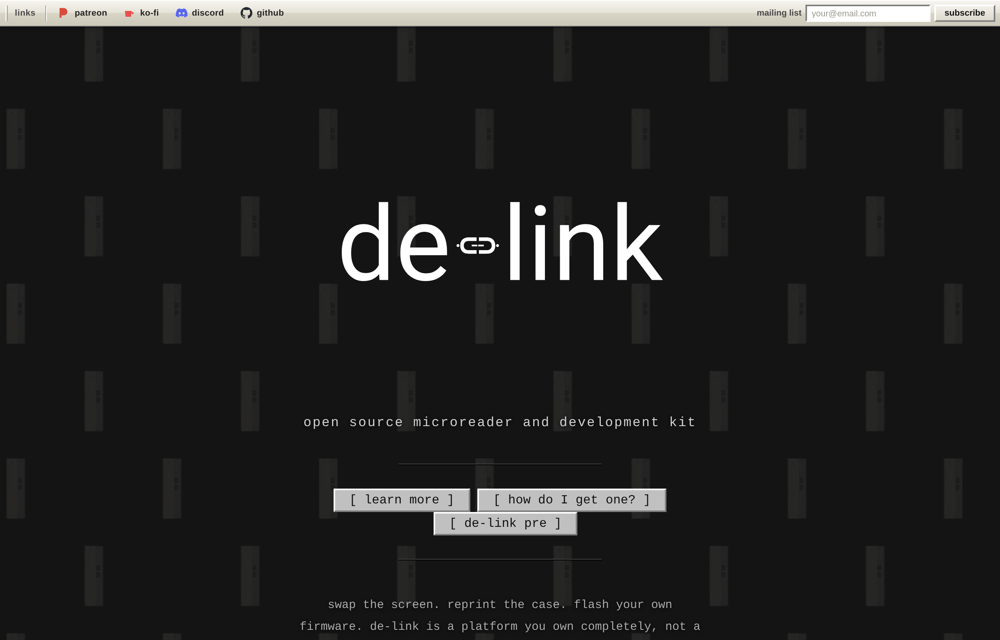
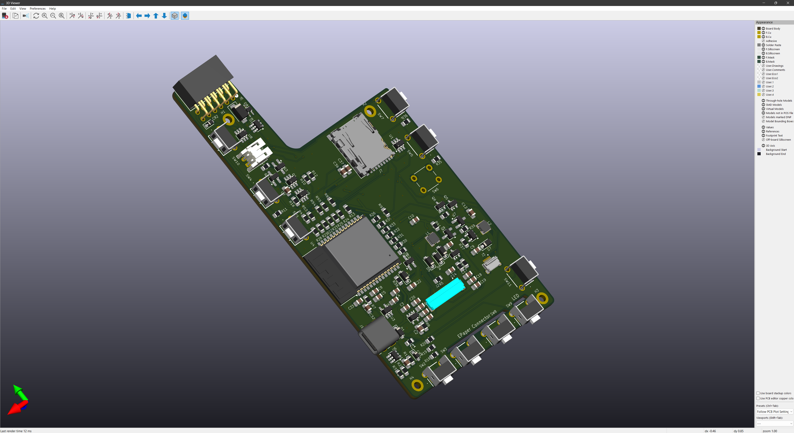

<!-- images live in images/ : images/homepage.png and images/pip-pcb-render.png -->

  

# de-link

open source microreader and development kit. ESP32-S3, 24-pin e-paper over SPI, 4-bit
SDMMC, USB-C, button array. hand-solderable, 3D-printable, and yours to modify.

---

**de-link is still in active development.** this repo is the original hub. it's kept here
with its history, schematics, and notes intact — but the current information now lives on
the site.

### learn more at [de-link.me](https://de-link.me)

specs, the full bill of materials, a 3D model you can rotate, the pre and pip editions,
and how to build one.

---

## the project today

de-link pip (v1.0) — the PCB design is almost finished.

## where things stand

- **pre** — the first prototype. built and documented.
- **pip (v1.0)** — the PCB design is almost finished. smaller, thinner, lower BOM cost.
- runs [crosspoint reader](https://crosspointreader.com) over USB-C. no locked bootloaders. no bricks.
- fully 3D-printable case. 0805 and SOT-23 throughout, hand-solderable. the BOM is open.
- optional modules — a series LED driver for frontlit panels (software cool/warm), and battery over-charge / discharge protection.
- full production files — KiCad, gerbers, CPL, STL, firmware — go public on launch.
- built in open collaboration with [freeink.org](https://freeink.org).

older numbers in this repo are out of date — an early ~$60 estimate, for one. the bill of
materials on the site is the current one.

## the hardware

- **screen** — any 24-pin GoodDisplay SPI e-paper panel. 3.97", 4.26", 7.5", and more. swap the screen without touching the PCB.
- **case** — fully 3D-printable. reprint as many times as you want. no molds, no minimums.
- **repair** — 0805 and SOT-23 throughout, hand-solderable. if something breaks, replace the part that broke.
- **battery** — bring your own single-cell 3.7V LiPo with a JST 2.0 connector.
- **software** — ESP32-S3 with USB-C OTG and no firmware restrictions. use crosspoint reader, fork it, or write something new.
- **storage** — 4-bit SDMMC for fast microSD reads. faster than the single-bit SPI most comparable devices use.

## the rest of the project

de-link is split across a few repos. this one points to them.

- [de-link-site](https://github.com/iandchasse/de-link-site) — the website. the main place for information now. start here.
- [de-link-pcb](https://github.com/iandchasse/de-link-pcb) — the hardware and PCB design files.
- [crosspoint-reader-de-link](https://github.com/iandchasse/crosspoint-reader-de-link) — reader firmware, ported to de-link.
- [freeink-sdk](https://github.com/iandchasse/freeink-sdk) — hardware-independent SDK for e-paper reader firmware (fork of [Free-Ink/freeink-sdk](https://github.com/Free-Ink/freeink-sdk)).
- [community-sdk-de-link](https://github.com/iandchasse/community-sdk-de-link) — community SDK.
- de-link — this repo. the original hub, kept for history.

## community

- discord — https://discord.gg/zCnKFt4Y4P
- patreon — https://www.patreon.com/iandchasse
- ko-fi — https://ko-fi.com/iandchasse
- mailing list — sign up on [the site](https://de-link.me) for hardware release news.

## about this repo

kept as part of the project's history. the old notes, schematics, and images are still
here — `markdown/`, `schematic/`, `images/`, `logos/`. for anything current, the site is
the source.
