# Prototype Details

Images and notes from building the initial de-link prototype.

---

## PCB Prototypes

  

    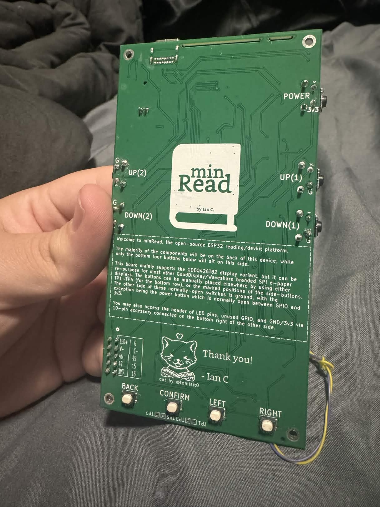
    
<em>PCB prototype front side</em>

  

  

    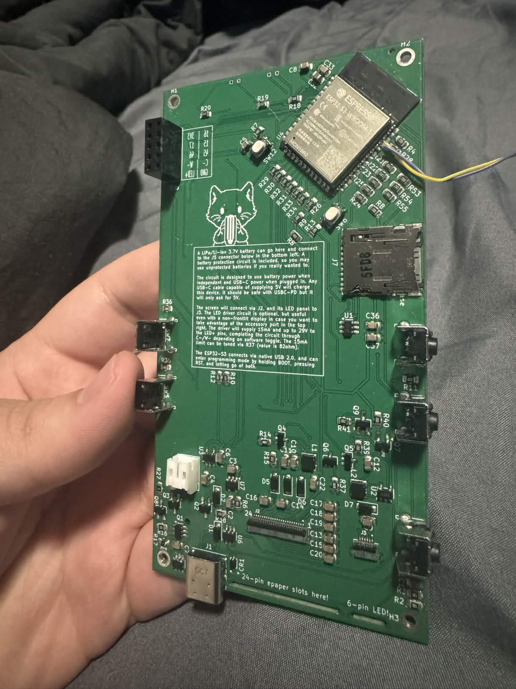
    
<em>PCB prototype back side</em>

  

Real image of the PCB, here with wires on the UART pins because I F'd up. Hopefully will avoid that in the future.

---

## Vape Battery
I only have one 650mAh protected battery and I opted to give it to my gf for safety. I am testing out the battery circuit by using a 22350 li-ion cell salvaged from a friend's disposable vape. **WARNING DO NOT SOLDER BATTERIES WITHOUT EXPERIENCE**

Oddly enough the hump is fairly ergonomic.

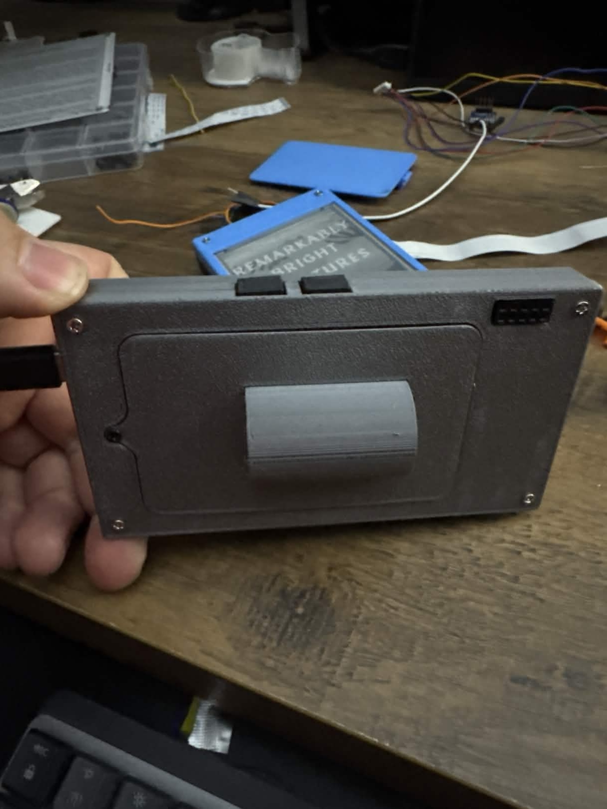

It makes a pretty good kick stand too.

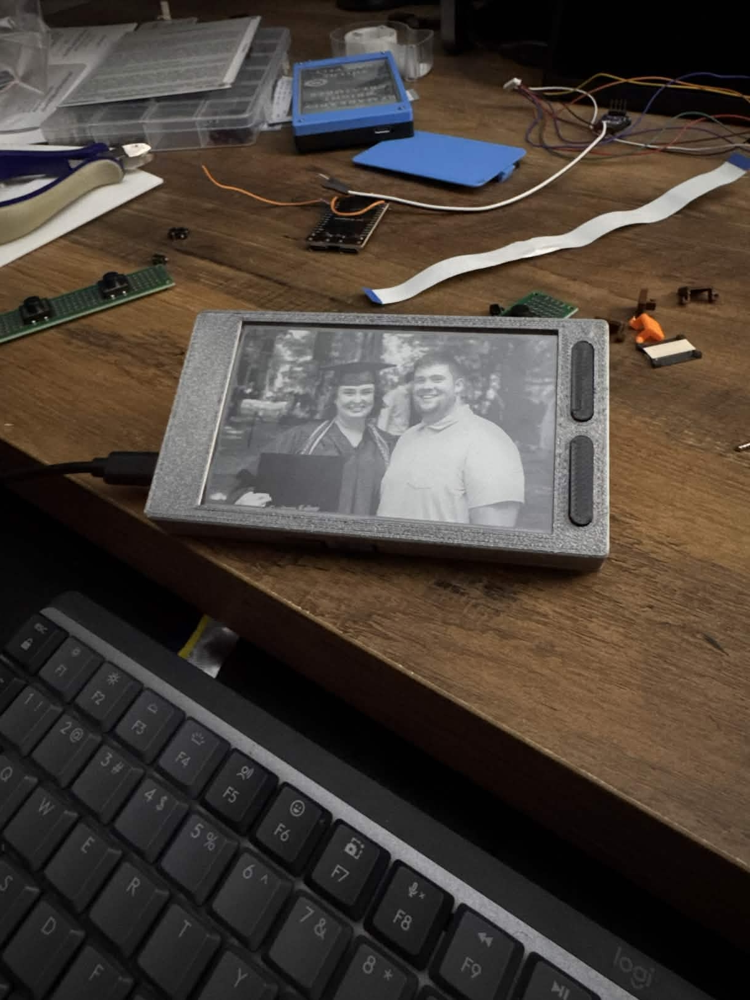

## Display Support

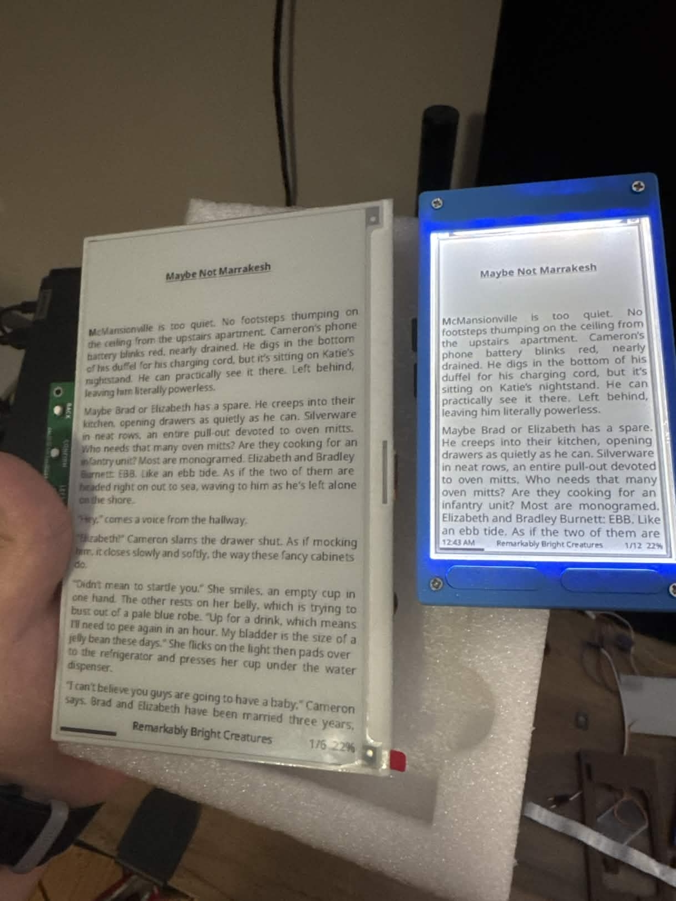

The PCB supports multiple GoodDisplay panel sizes. Shown here is the 7.5" display option, demonstrating the scalability of the design beyond the 4.26" prototype. Also, I had much easier code working for a slightly smaller 3.97" display, before I tragically snapped the ribbon cable.

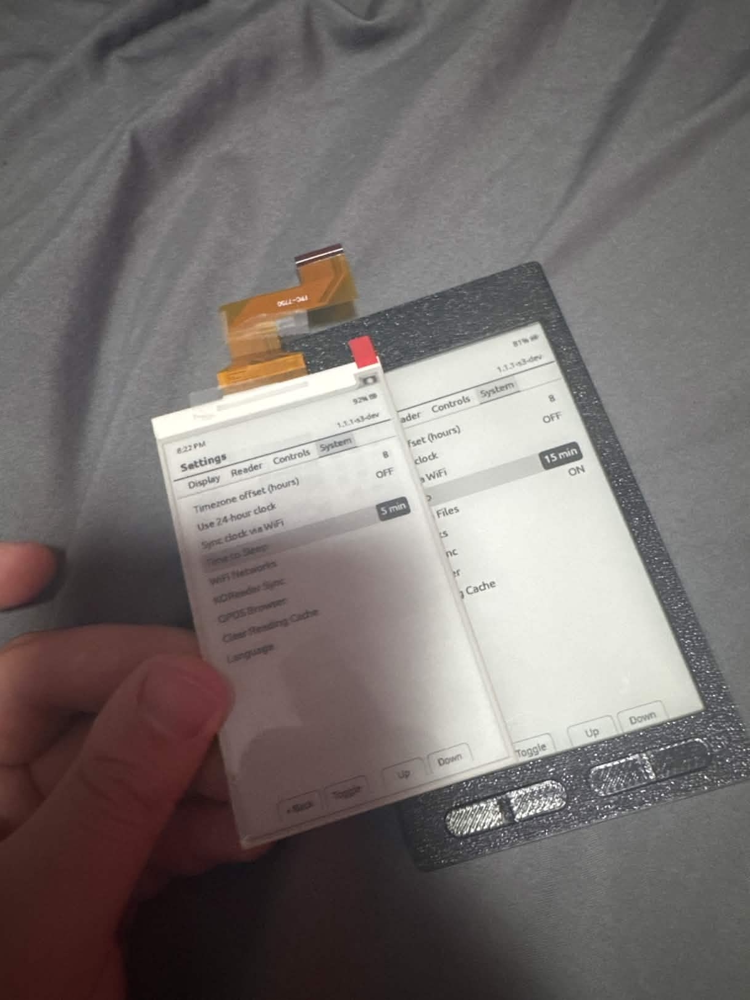

These are the main two displays I hope to make enclosures for first, as they both have the same resolution as the 4.26" screen (800x480) and are in high stock.

---

## Power Characteristics

Understanding power consumption across different modes helps with battery life planning.

  

    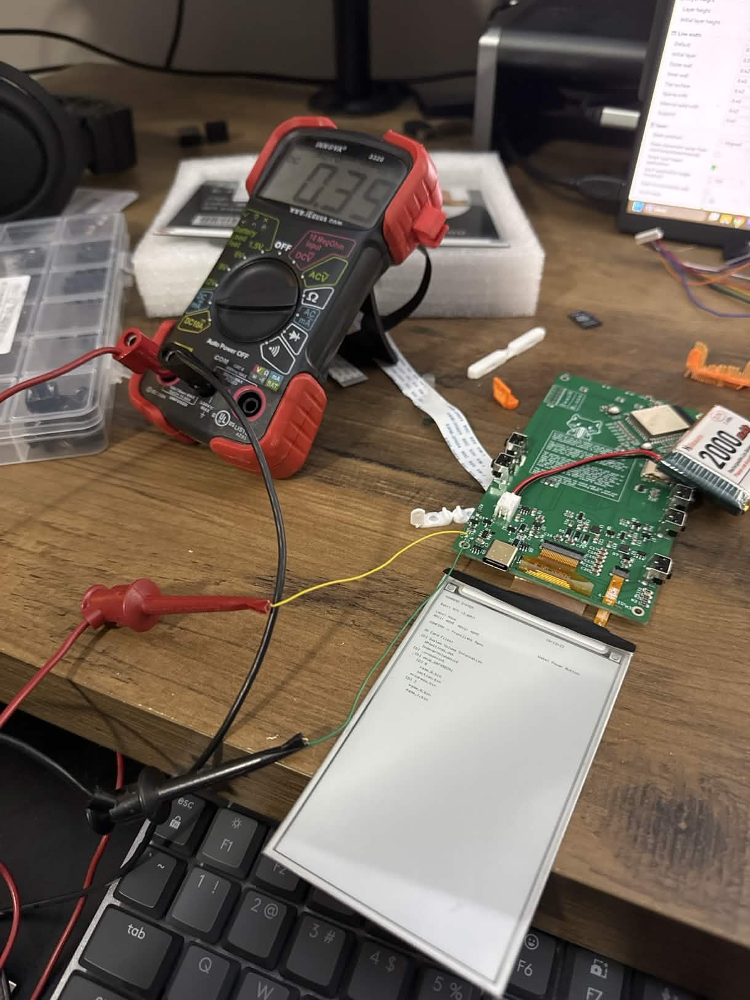
    
<em>Active operation</em>

  

  
  

    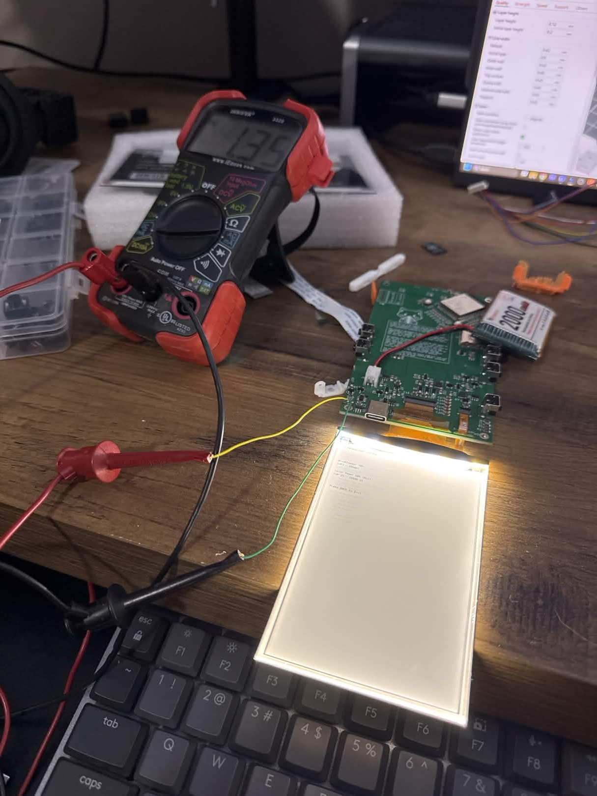
    
<em>LED module</em>

  

  

    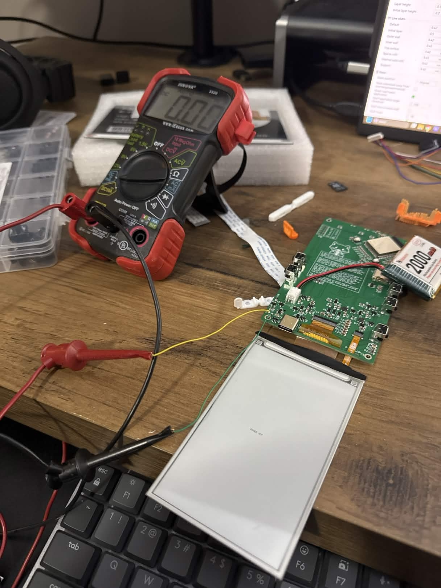
    
<em>Deep sleep mode</em>

  

This is what I emphasize for "sleep/wake" in [COMPARISON.md](markdown/COMPARISON.md). The current draw is nearly nothing when in deep sleep even though the LDO is connected. 

---

## Font Rendering

Using the PSRAM on the device, I tinkered around with generating custom fonts on the device with just .ttf files.

  

    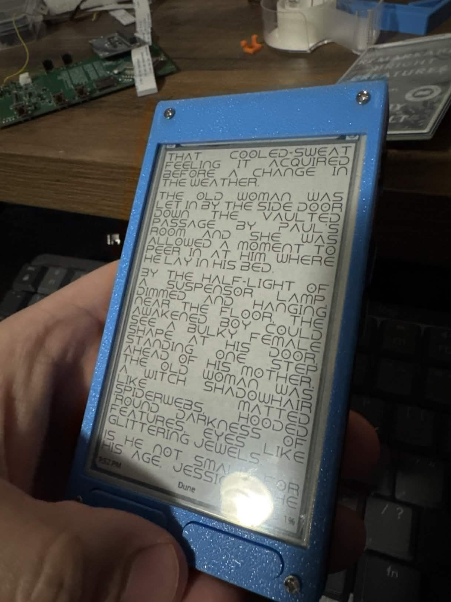
    
<em>Font rendering example</em>

  

  

    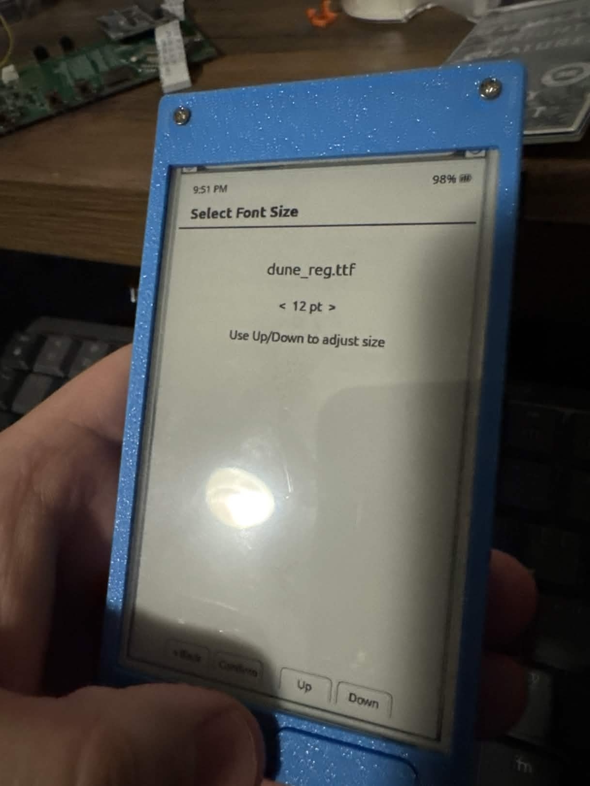
    
<em>Custom font generation tool</em>

  

Reading Dune in Dune font. Why not.

---

## Colors

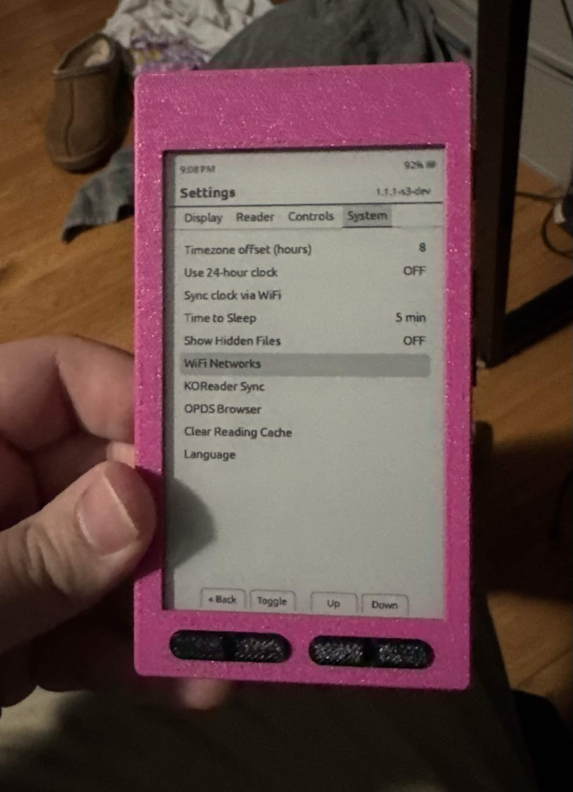
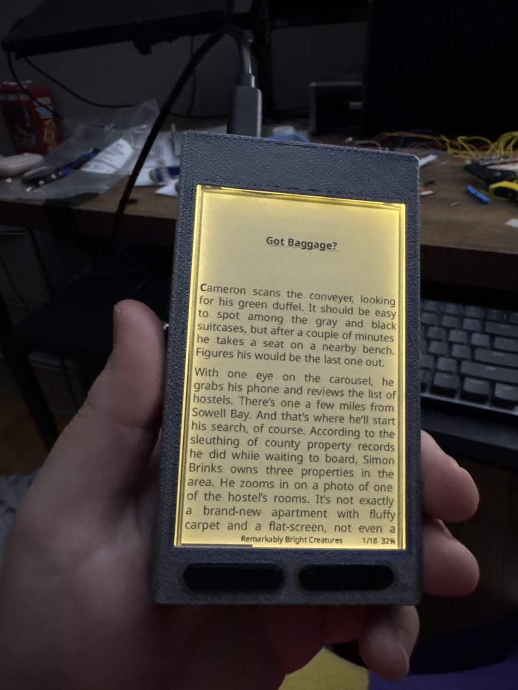

Taking advantage of spare filament.

---

[Back to README](README.md)
